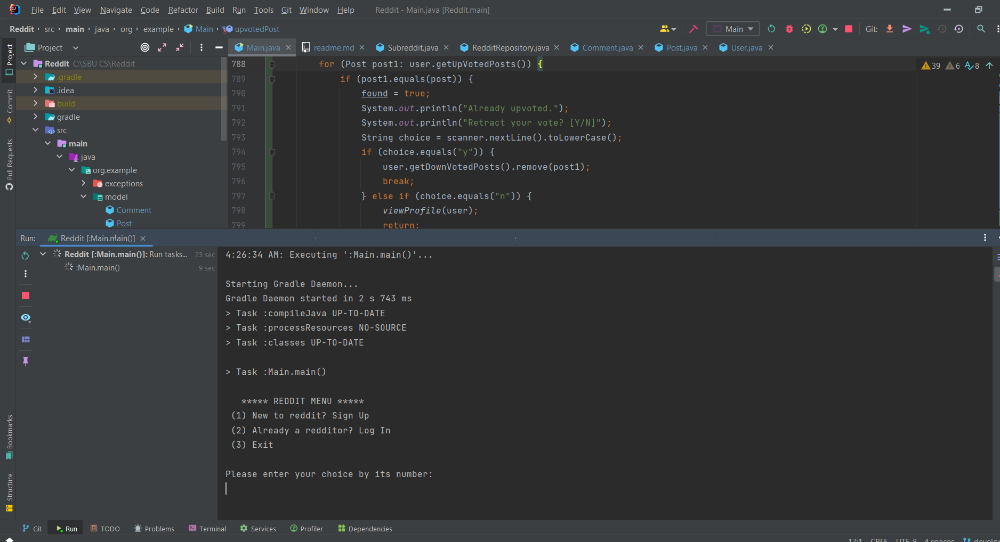
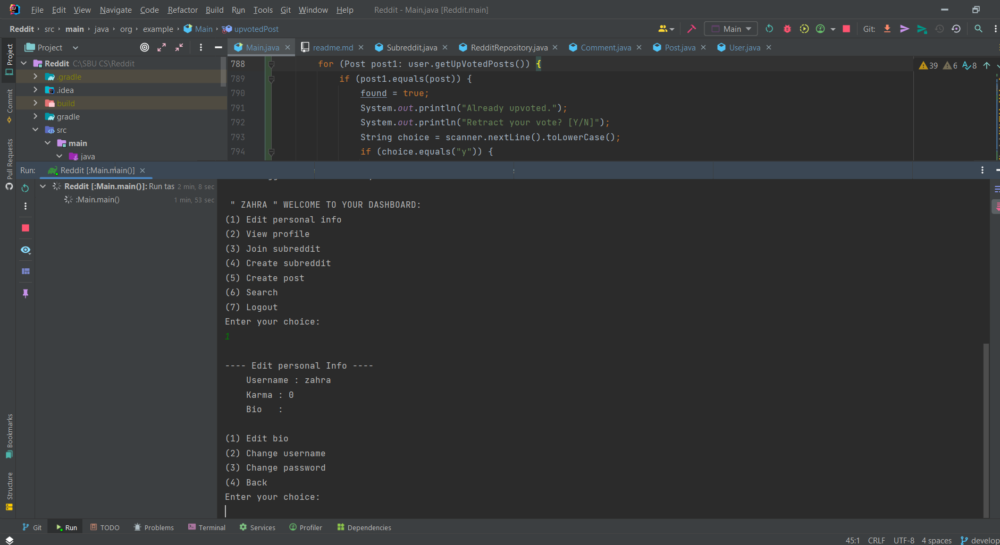

# Reddit
## Table of contents
1. [Description](#description)
2. [Usage](#usage)
3. [Demo/GIFs/Images](#Demo/GIFs/Images)
4. [Credit](#credit)
5. [Changelog](#changelog)
6. [Contact Information](#ContactInformation)

## Description 
This is my advanced programming mid-term project, which is a Reddit-like application
implemented in Java. It allows users to create subreddit and post, upvote/ downvote on them.
## Usage 
### Reddit Menu
- **Sign up**
- **Log in**
    - User menu
- **Exit**
### Sign up
- a user exists with this username
- email format validation
- confirm password
- sign up successful
### Log in
- no user exists with this username
- incorrect password
- log in successful

### User Menu

#### Edit personal info
- change password 
- change username (already taken or not)
- edit bio
- view karma score

**back**

#### View profile
**ATTENTION!: You can do these actions, only in this menu:**
**Upvote, Downvote , Unsubscribe, Delete, Unsaved, Saved, Leave comment.**

**posts:**
- view created posts list
- view saved posts list
- view timeline posts list

actions: upvote, downvote, delete, unsaved, saved, leave comment.

**posts and comments:**

- view Upvoted
  - comments
  - posts
- view Downvoted
  - comments
  - posts

actions: upvote, downvote, retracting vote

**subreddits:**

- view subscribed subreddits list
- view created subreddits list

actions: unsubscribe, delete

**back**

#### Create & join subreddit

- complete info such as name, description, etc.
- join subreddits and view their posts
- create post

#### Create post

  - view subscribed subreddits list
  - view created subreddits list
  - create post

**back**
#### Leave comment
- select a post
- is it locked or not
- leave comment

**back**

#### Search
- find subreddit based on their names
- find users based on their names

**back**
#### Log out
### Exit

## Demo/GIFs/Images 

## Credits 
[Reddit](https://www.reddit.com/)

[Stack overflow](https://stackoverflow.com/)

[chatGPT](https://chat.openai.com/)
## Changelog 
* 0.3
  * Created a menu for displaying details.
* 0.2
  * Completed the classes and defined methods
  * See [commit change](https://github.com/ZahraShafiei14/Reddit/commits/develop/)
* 0.1
  * Initial Release
## Contact Information 
If you encounter any issues, refer to the [README](https://github.com/ZahraShafiei14/Reddit/blob/master/readme.md) file or if you prefer direct assistance,
feel free to reach out to me via the following link: [Contact Me](zahrashafiei@gmail.com).
